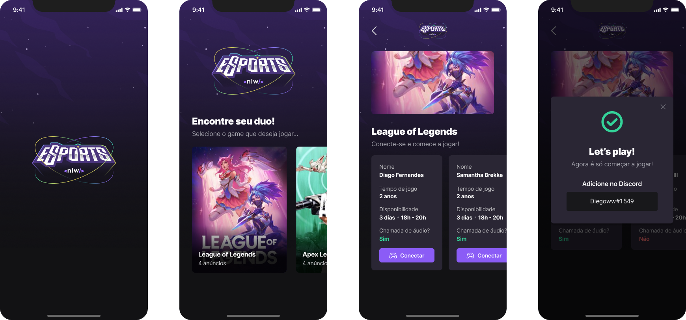

  <a href="#-tecnologias">Tecnologias</a>&nbsp;&nbsp;&nbsp;|&nbsp;&nbsp;&nbsp;
  <a href="#-projeto">Projeto</a>&nbsp;&nbsp;&nbsp;|&nbsp;&nbsp;&nbsp;
  <a href="#-layout">Layout</a>&nbsp;&nbsp;&nbsp;|&nbsp;&nbsp;&nbsp;

 

 

  

  

## 🚀 Tecnologias

Esse projeto foi desenvolvido com as seguintes tecnologias:

React JS
- Radix
- Axios
- Phosphor-react
- Tailwind Css

React Native
- Expo
- Phosphor-react

Node.js
- Prisma
- Cors

## 💻 Projeto

Nessa NLW eSports a ideia desse projeto foi fazer um app onde jogadores encontrem seus duos para jogarem juntos.

  **Para rodar o projeto é necessário instalar com NPM i todas as dependências na WEB e Server. Os projetos podem ser executados pelo NPM RUN DEV e para visualizar o banco de dados direto pelo browser NPX PRISMA STUDIO.**
  
  
  **Para rodar o projeto Mobile é necessário instalar as dependencias com NPM EXPO INSTALL. O projeto pode ser executado tanto por emulador quanto pelo APP em seu       aparelho móvel. Para executa-lo, EXPO START**

## 🔖 Layout

Você pode visualizar o layout do projeto através [desse link](https://www.figma.com/community/file/1150897317533332617). É necessário ter conta no [Figma](https://figma.com) para acessá-lo.

---

Feito com ♥ by Victor Schmücker :wave:
